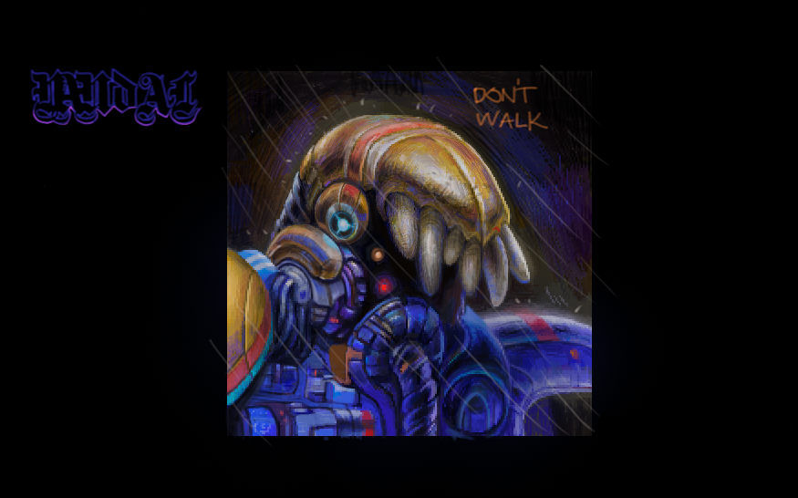
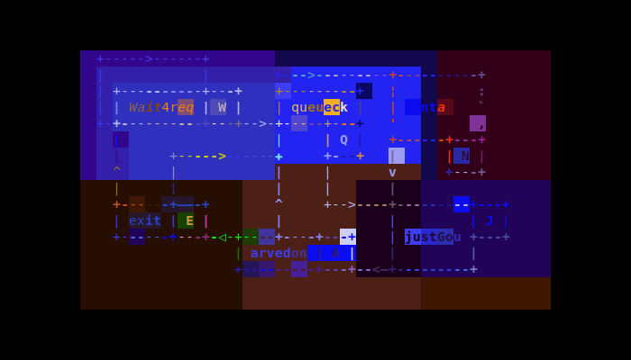
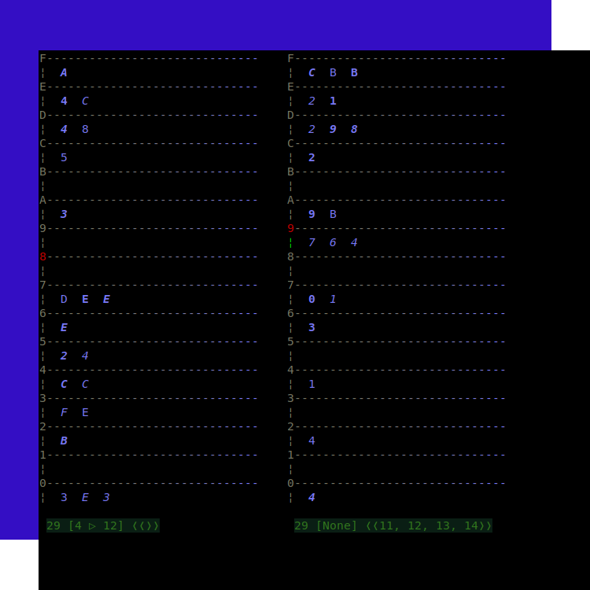

## *題 namba tuu*
**I**n this problem there are bunch of lifts, synchronized by an external
clock, controlled by a ***Command Center***, that is the program we have
to write, by receiving *external* and *internal* requests on each clock
tick. The problem of the
[*problem*](https://ioinformatics.org/files/ioi1989problem2.pdf)
is that it only takes the lift's perspective, zo all inputs have to
be done manually (one should take care that there are no internal
requests from an empty lift etc.). Zo I've decided to extend the program
from pure controlling unit to a simulation based on a *scv* requests
in the form ***(orig, dest)***, vich are later transformed into internal
requests.

### ℥ʈrateζy
**Okay** if I was responsible for the lift strategy, there will be a lot
of *scv* complains in the *Com Center* (not to mention that I'm living
on ze second floor). If ve hafe a **marinne** on ze first floor going to
ze last floor, and in the next cycle, a *scv* appears vith a reqvest
***3 ▷ 10***, vat ve are going to zo? Thatz the Q! The Answer
is we pick that *scv*, but that's not always the case, for if we have an
empty lift going up called from a request that's going down or
vice versa we raise an *ignore flag*, otherwise we pick all *scv* requests
from the waiting *queue* with same directions as the lift. ***Thatz.***

### *The algorithm*
The decisions a lift takes are handled by a sequence of *actions*
per *clock cycle*. There are six different *actions*:

1. *wait4req* (waiting for requests)
2. *queueck*  (queue check)
3. *nta*      (enter)
4. **justGou**  (go go go)
5. *exit*     (what is this?)
6. *arvedon*  ***(eNOuPe)***

At the end of each *action* we assign the ***next*** *action*
depending on different conditions, e.g. the *next* ***action***
of *wait4req* is either the same or *queueck* depending if there
is a request etc. Here is the complete action graph:



## lift.py

The script uses *f-formatting* so it will run with python3.6 or later
. I've also made some experiments with  *Unicode Characters* mostly
for comments but also for *unit time* and *lambda* parameters,
so there might be some possible issues like not displaying some symbols
correctly etc.

You can view short descriptions and default values of program's
options with *lift.py --help*:
 ```
usage: lift.py [-h] [--lambda Λ] [--mode MODE] [-n NCYCLES]
                [--nfloors NFLOORS] [--nlifts NLIFTS] [--simula] [-t ΔT]
                [--verbose] [--visual]

optional arguments:
  -h, --help         show this help message and exit
  --lambda Λ         Poisson pdf parameter (--simula) (default: 0.3)
  --mode MODE        Com Center mode of operation (default: 0)
  -n NCYCLES         number of cycles (-1 for inf. loop) (default: 12)
  --nfloors NFLOORS  number of floors (default: 16)
  --nlifts NLIFTS    number of lifts (default: 1)
  --simula           generate random users (default: False)
  -t ΔT              time in sec. between 2 clock ticks (default: 2)
  --verbose          debug info (default: False)
  --visual           ze old hacker (default: False)
```

Most of them are self-explanatory but some of them require a bit more
detailed explanation:

* mode 

  if set to one all even and odd request will be assigned to an even
  or odd indexed lifts respectively

* lambda

  from *Probability Theory* we know that the number of people entering
  a building per unit time is a *Poisson Distribution*. The value of
  this parameter is equal to the mean number of *scvs* entering the
  *Com Center* per ***clock cycle***. It is used when *--simula*
  option is set. Usually one has to increase this value when there are
  moar number of lifts.

* visual

  Ze old hacker (xterm control seq). It automatically sets *--simula*
  as well. I probably had to upload a video showing the simulation,
  but I've made only a screenshot at the end of the following command:
  
  ```lift.py -n 30 --lambda 1.5 --visual --nlifts 2```



https://youtu.be/Qo4JIT8jMtI